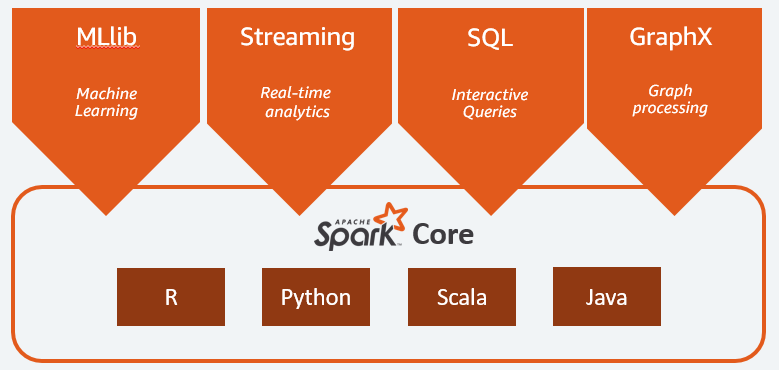
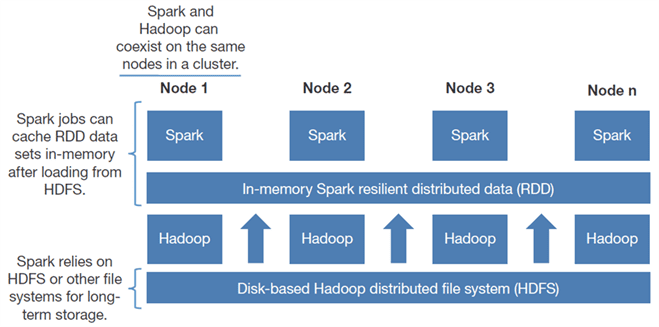

Lets understand MapReduce with an example.

Lets say we have data of LinkedIn where one user viewed another users profile. For simplicity, we are taking 6 lines of data

| s.no. | from user | to user |
| ----- | --------- | ------- |
| 1     | User A    | User B  |
| 2     | User B    | User C  |
| 3     | User A    | User C  |
| 4     | User D    | User B  |
| 5     | User B    | User A  |
| 6     | User E    | User B  |

Above data can be interpreted as User A visited user B's profile in LinkedIn. We want to understand how many views are there for a particular profile.

Step 1 - Record Reader Output

(1, [1,User A, User B])
(2,[2,User B, User C])
(3, [3, User A, User C])
(4, [4,User D, User B])
(5, [5, User B, User A])
(6,[6,User E, User B])

Step 2 - Mapper Output

(User B,1)
(User C, 1)
(User C, 1)
(User B,1)
(User A,1)
(User B,1)

Step 3 - Shuffle - Sort

(User A, 1)
(User B,1)
(User B,1)
(User B,1)
(User C, 1)
(User C, 1)

(User A, {1})
(User B, {1,1,1})
(User C,{1,1})

Step 4 - Reducer

(User A, 1)
(User B, 3)
(User C, 2)

How many mappers would run? - It depends on no. of blocks a file is broken down.

How many mappers would run in parallel? - It depends on the cluster configuration (mo. of data nodes)

How many reducers would run? - This developer can configure. Can be zero or more than 1 but by default it is 1.

When reducer is over burdened, then we can increase the no. of reducers to optimize your job. 
- if we have more than one reducer, then mappers output will be divided into **partitions** based on number of reducers
- There is a **hash function** which is inbuilt, will partition the data at mapper. And this will define which partition will go to which reducer. This Hash function is very consistent meaning all the same keys should go to same reducer.
- If you have to define **custom partitioning logic**, we can write your own logic but this logic should be consistent.

When you don't need to aggregate then we don't require reducer. Example - filtering data.
- if a file is 1GB and by default this is divided into 8 blocks. we will have 8 output files.

---

Another Example - 

If a sensor records temperature every hour and we have to find the max temperature day wise using MR.

data might be in below format

| date | time | temperature |
| ---- | ---- | ----------- |
| D1   | T1   | 47          |
| D1   | T2   | 49          |
| D1   | T3   | 45          |
| D2   | T1   | 39          |
| D2   | T2   | 38          |
| D2   | T3   | 40          |

Mapper output can be

M1 
(D1,47)
(D1,49)
M2
(D1,45)
(D2,39)
M3
(D2,38)
(D2,40)

At reducer, we will find the max for each day

(D1,49)
(D2, 40)

In the above case, most of the processing is done at reducer end and minimal activity at mapper end. 

If at mapper end, we have performed local aggregation which is called **combiner**, Then at reducer end to some extent we could have reduced the burden.

Instead mapper output can be
M1
(D1,49)
M2
(D1,45)
(D2,39)
M3
(D2,40)

At reducer, output can be

(D1,49)
(D2, 40)

**Combiner helps us to optimize but should be used with caution.** Because if you have to find the average, then you cant find average at each mapper instead finding sum and count from each mapper would yield correct result.

---

MapReduce code can be executed from below command

``` console
hadoop jar <jar path> <input hdfs file path> <non existing output directory>
```

---
##### Apache Spark

Challenges with MapReduce.
1. Performance is low because of lot of disk IO's (each MR task takes the data from HDFS, process it and place back in HDFS)
2. Hard to write the MR code
3. Supports only batch processing
4. No interactive mode
5. Lot of tools to learn
6. Every problem should be thought in Map and Reduce way. 

Apache Spark is a **multi language engine** for executing **data engineer, data science and machine learning** tasks on **single node or cluster**.

Spark with Python - **PySpark**

In Spark, from HDFS we read the data from disk and load it into memory and output of one spark transformation will be input of another and finally writes back to HDFS. In best case only 2 disks IO's are required. 

For 5 MR job - 10 disk IO's but in spark only have 2 IO's in best case.

**Spark abstracts the notion that we are writing code to run across the cluster.**

---

##### What is Databricks

Apache Spark is Open Source. Databricks is a company and they have a product called Databricks.
It is developed by same set of people who developed spark.
Databricks is a spark with some extra features
- Spark on cloud
- Optimized spark
- Cluster Management
- Delta lake
- Collaborate Notebooks
- Implemented Security.

Spark Components



Spark Core API's - you work at the RDD(Resilient Distributed Dataset) level. It is the hardest way to work but offers more flexibility. It is the basic unit which holds data.

Spark Higher level API's
- Spark SQL/ Data Frames (simplest way to work - Spark SQL)
- Structured Streaming 
- MLlib
- GraphX

---
##### RDD 


pseudo code
- load file1 from HDFS/ data lake (rdd1)
- rdd2 = rdd1.map
- rdd3 - rdd2.filter
- rdd3.collect() 

There are  2 kind of operations in Apache Spark
1. Transformation
2. Action

All the **transformations are lazy but actions are not**. (in the above example, first steps will not execute till the 4 line is reached.).  An **execution plan** is created for all the jobs in Spark using **DAG(Directed Acyclic Graph)**.

In Spark we have **Driver node and worker node**.

RDDs are 
- Resilient because its fault tolerant. Lets say for any reason we lost rdd3, we can regenerate this from rdd2. Fault-tolerant as they can track **data lineage** information to allow for rebuilding lost data automatically on failure. 
- Immutable.
- Distributed because data is distributed across multiple nodes in cluster.

Why transformations are lazy? - **Spark will have a chance to optimize the execution plan by looking at the DAG entirely.**

Lets say we have a employee data with 1billions. but we are interested to look at one employee info. 

If Spark transformations are not lazy, then it will load all the data and create 1 billion records and does all the transformations on this and filter the data at last step.

Because its lazy, Spark will optimize the execution plan and run the job.