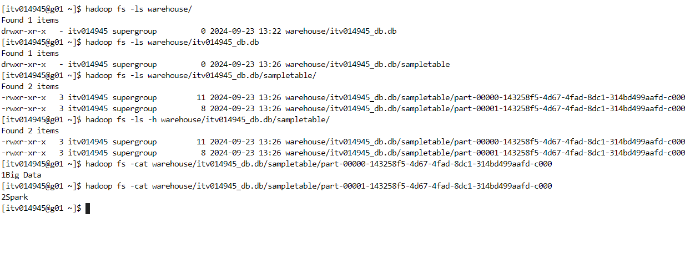
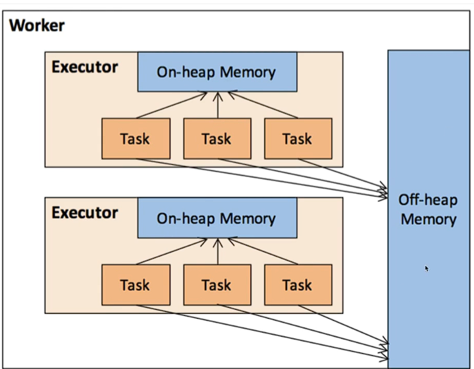

##### Spark SQL & Data frames

In spark core API's, we saw we chain transformations and call actions using RDD. RDD doesn't have any schema or metadata associated with it.

Creators of Spark recommend to use Higher level API's as lot of **optimizations** are present in spark engine.

**Spark SQL** 
- **data** will be present on **disk** - data lake & **metadata on meta store**
- **Spark Table is persistent**
- available across sessions

Data frames 
- RDD with some structure(schema/ metadata)
- **data & metadata - in memory**
- no meta store, your meta data is kept **temporarily** in metadata catalog.
- available only with in session

---
##### Data frame Reader

How to create a data frame?

``` python
orders_df = spark.read \
.format("csv") \
.option("header","true") \
.option("inferSchema","true") \
.load("/public/trendytech/orders_wh/*")
```
\
``` python
orders_df.show()
orders_df.show(5)
orders_df.show(20)
orders_df.printSchema()
```

It is **not recommended to use infer schema** as 
- it might not infer the schema correctly
- to infer schema, spark engine has to scan the data. Might lead to performance issues.

```python
renamed_orders_df = orders_df.withColumnRenamed("order_status","status")
renamed_orders_df.show(5)
```

```python
from pyspark.sql.functions import to_timestamp
changed_datatype_df=renamed_orders_df.withColumn("orders_date", to_timestamp("order_date"))
changed_datatype_df.printSchema()
```

There are various shortcut methods to read data from different sources/file formats to data frame but standard method is to use **read** method.

``` python
orders_csv_df = spark.read \
.csv("/public/trendytech/orders_wh/*", \
     header = "true", \
     inferSchema="true")
orders_csv_df.show(5)
```

``` python
orders_json_df = spark.read.json("/public/trendytech/datasets/orders.json")
orders_json_df.show(5)
orders_json_df.printSchema()
```

``` python
orders_parquet_df = spark.read.parquet("/public/trendytech/datasets/ordersparquet")
orders_parquet_df.show(5)
orders_parquet_df.printSchema()
```

Parquet is the best file format for spark. Its a columnar storage.

``` python
orders_orc_df = spark.read.orc("/public/trendytech/datasets/ordersorc")
orders_orc_df.show(5)
orders_orc_df.printSchema()
```

**Filtering data**

``` python
filtered_data = orders_df.where("customer_id = 11599")
filtered_data.show(truncate = False)
```

``` python
filtered_data_using_filter = orders_df.filter("customer_id = 11599")
filtered_data_using_filter.show()
```

**Spark Table/View**

``` python
orders_df.createOrReplaceTempView("orders")
filtered_using_spark_sql_df = spark.sql("select * from orders where order_status = 'CLOSED'")
filtered_using_spark_sql_df.show(5, truncate=False)
```

createOrReplaceTempView will create a spark table which is accessible in your session.
createOrReplaceGlobalTempView will create a spark table which can be accessible across multiple spark applications/notebooks/sessions

**Spark Table to Data Frame**

```python
orders_df_using_spark_sql = spark.read.table("orders")
orders_df_using_spark_sql.show(5)
```

---

##### Spark SQL

First we have to create database and then we can work with the database by creating tables and much more.

```python
spark.sql("create database if not exists itv014945_db")
spark.sql("show databases").show(5)
spark.sql("show databases").filter("namespace = 'itv014945_db'").show()
spark.sql("show databases").filter("namespace like 'itv014945_%'").show()
spark.sql("show tables").show(5) # shows results in default database
```

``` python
spark.sql("use itv014945_db") 
spark.sql("show tables").show(5)
spark.sql("create table itv014945_db.sampleTable(id integer, name string)")
spark.sql("show tables").show(5)
spark.sql("insert into itv014945_db.sampleTable values(1,'Big Data'),(2,'Spark')")
spark.sql("select * from itv014945_db.sampleTable")
spark.sql("describe table itv014945_db.sampleTable").show()
spark.sql("describe extended itv014945_db.sampleTable").show(truncate=False)
spark.sql("describe formatted itv014945_db.sampleTable").show(truncate=False)
```

The database will be created in HDFS and you can navigate to see the data which is stored in files

``` console
hadoop fs -ls -h warehouse/itv014945_db.db/sampletable/
```



---
##### Managed vs External Table

In Managed table, if you drop the table, both **data and metadata** will be whipped off.
In External table, if you drop the table, only **metadata** will be whipped off.

``` python
spark.sql("create table itv014945_db.orders_ext (order_id integer,order_date string,customer_id integer,order_status string) using csv location '/public/trendytech/orders/orders.csv'")
```

Insert will work on external table. Spark engine will create a new file if a directory is given in location but is not advisable to perform inserts on external tables

Update and delete wont work but will work in delta lake.

---
##### Spark Optimization

1. **Application Code level Optimization** like using cache, use reduceByKey instead of groupByKey
2. **Cluster Level Optimization** - Is our job getting enough resources(RAM & CPU cores) or not?
	
There is concept of **Executor** which is like a container of resources. Which we can use to tune the resource consumption. 1 node can have multiple executors(JVM).

There are two strategies

**Thin Executor** - Intention is to create more executors/containers/JVMs with each one holding minimum possible resources.

Drawbacks -  We will loose benefit of **Multi threading** and lot of copies of **broadcast** variable are required so that each executor receives its own copy

**Fat Executor** -  Intention is to create less executors/containers/JVMs with each one holding maximum possible resources.

Drawbacks - Due to lot of multi threading, **HDFS throughput** suffers. (if there are more than 5 CPU cores then HDFS throughput suffers).
If a executor holds lot of data in memory then **garbage collection** takes lot of time.

We shouldn't have Thin or Fat Executor instead we should choose balanced approach.

Lets understand this with example.

Lets say you have 10 node cluster, each node with 16 cores and 64GB RAM.

On each node, 1 node will be taken for background activities and 1 GB RAM for OS.

We are left with 15 cores and 63 GB RAM. We know that if there are more than 5 CPU cores then HDFS  throughput suffers. So 5 will be the optimal choice.

We can have 3 executors, each having 5 cores and 21GB RAM.

Out of 21 GB, some part will go for **overhead or off heap memory** = **max(384MB, 7% of executor RAM)**

approximately, 1.5 GB will go for off heap memory and we left with 19 GB RAM.

So, we can have 3 executors with 5 cores and 19GB RAM. In a 10 node cluster, we can have 30 executors. Out of 30, one will be taken by YARN.

Overall on a 10 node cluster each having 16 cores and 64GB RAM. For ideal case, we can have 29 executors each having  5 cores and 19GB RAM.



---
